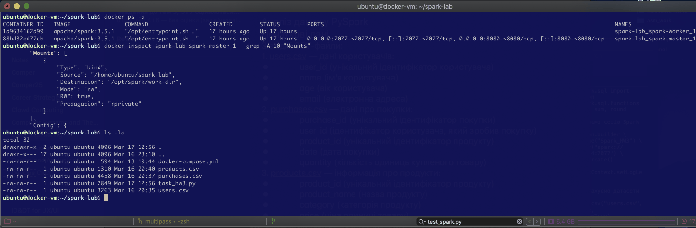
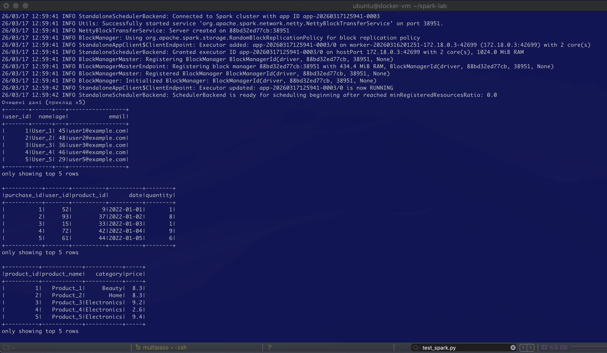
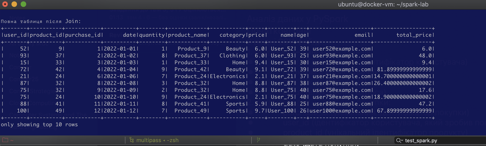
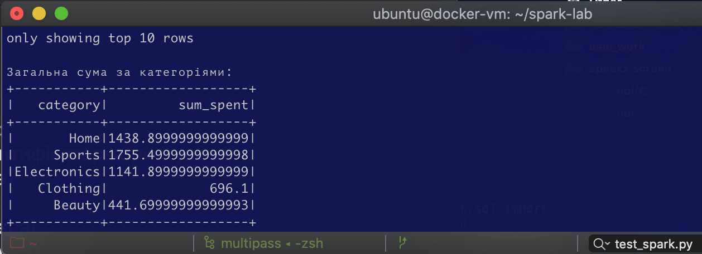
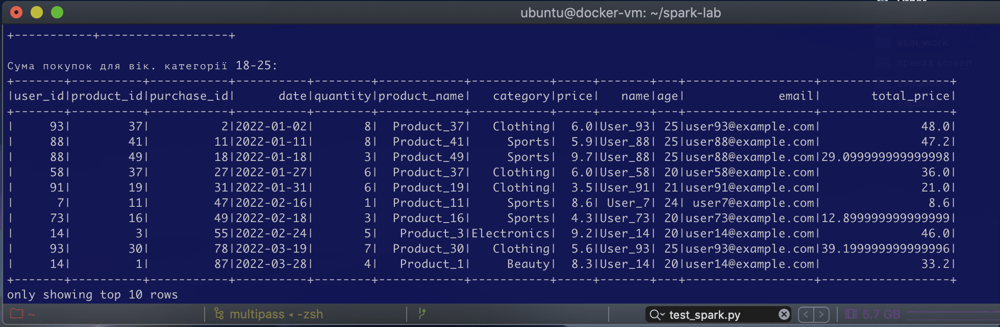
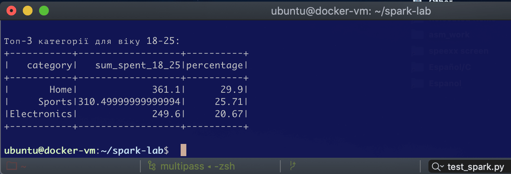

# PySpark Data Analysis Project (DATA ENGINEERING)

## Project Overview
This project demonstrates a complete ETL (Extract, Transform, Load) pipeline using PySpark. It analyzes user purchase behavior across different product categories, with a specific focus on demographic segmentation (age group 18-25).

### Tech Stack & Infrastructure
- **Engine**: Apache Spark 3.5.1 (PySpark)

- **Environment**: Hybrid Architecture

- **Local Development**: PyCharm on macOS

- **Execution**: Ubuntu VM running a Spark Cluster in Docker (multipass shell docker-vm)

- **Version Control**: Git/GitHub

- **Deployment**: Automated SFTP sync between IDE and Remote VM

### How to Run
1. Ensure the Spark Docker cluster is active on the VM.



2. Place the CSV files in the shared `/opt/spark/work-dir`.
3. Execute the job via Spark Submit:
   ```bash
   docker exec -it spark-master /opt/spark/bin/spark-submit --master spark://spark-master:7077 work-dir/task_hw3.py
   ```

### Key Tasks Performed

- Data Integration: Loaded and parsed multiple **CSV datasets** (users, products, purchases).

- Data Cleaning: Implemented automated handling of missing values (dropna).



- Relational Joins: Performed complex multi-way joins to unify disparate data sources.



- Feature Engineering: Calculated total expenditure per transaction using Spark transformations.



- Demographic Analysis: Filtered and aggregated data to identify spending patterns for specific age cohorts.



- Statistical Reporting: Calculated percentage shares of total spending per category and ranked the top performers.



### Visualizations
The results of the analysis, including intermediate transformations and final ranking tables, are captured via Spark's df.show() method and stored in the **/screenshots** directory of this repository.