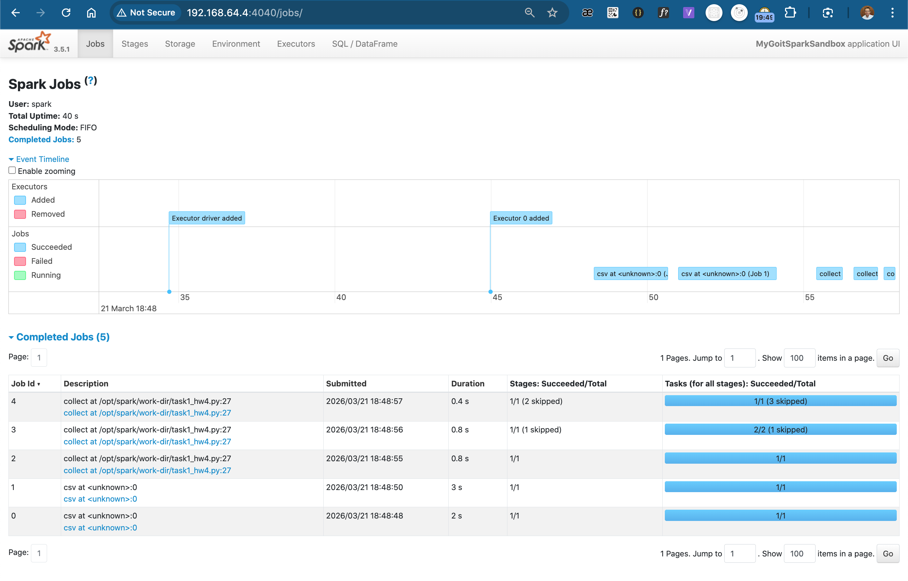
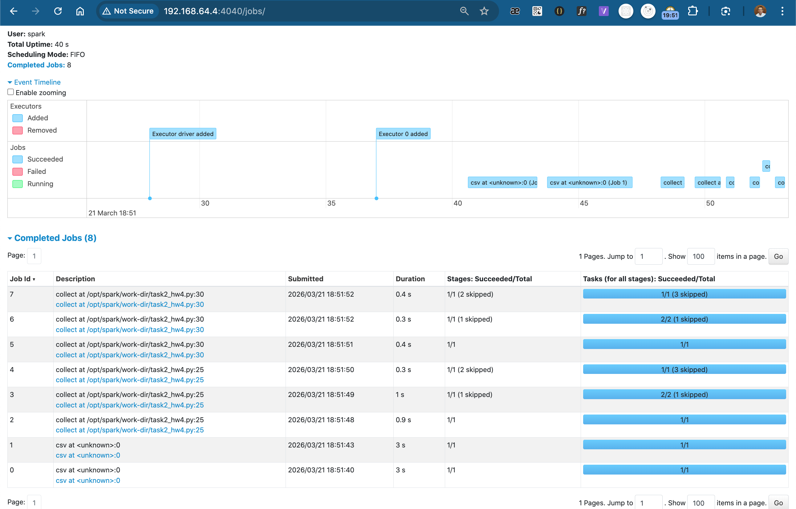
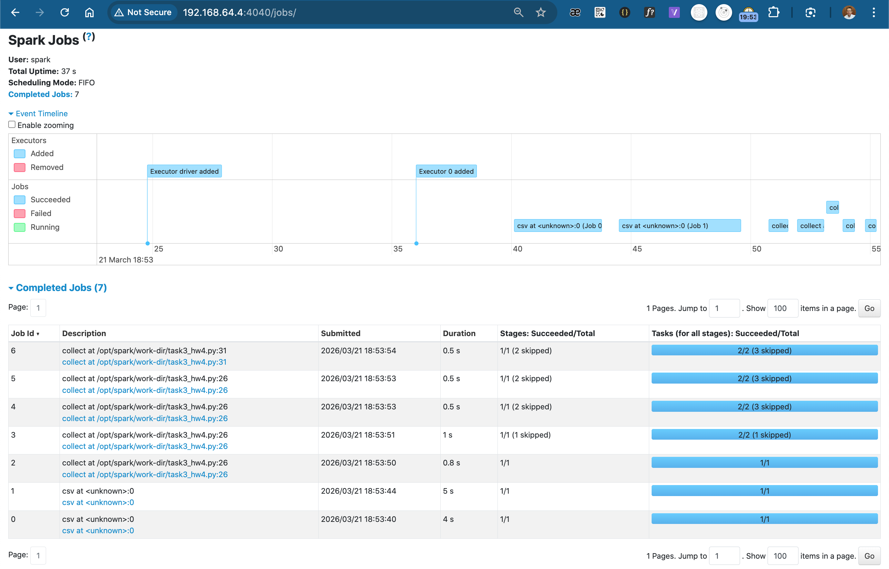

# PySpark Optimization & SparkUI Analysis

This project focuses on understanding how Apache Spark executes jobs under the hood. By analyzing the SparkUI, we investigated the impact of intermediate actions and the efficiency of data caching in a distributed environment.

## 🛠 Infrastructure
**Execution**: Ubuntu VM on macOS (Dockerized Spark Cluster)

**Configuration**: 2 Shuffle Partitions (spark.sql.shuffle.partitions=2)

**Environment**: VS Code Remote-SSH directly to the VM
  `(SparkSession.builder.master("spark://192.168.64.4:7077"))`

## 🔍 Execution Analysis
### Part 1: standard execution (5 jobs)
In this baseline scenario, Spark uses lazy evaluation. It builds a logical plan and only executes it when the final `collect()` is called. The 5 jobs represent the overhead of reading the schema, repartitioning the data, and performing the aggregation.

### Part 2: added intermediate action (8 jobs)
By adding a `nuek_processed.collect()` in the middle of the script, an extra execution is triggered. Because the data wasn't cached, Spark was forced to re-calculate the entire lineage (reading the CSV and grouping) for the second output. This resulted in 3 additional redundant jobs.

### Part 3: optimized with caching (7 Jobs)
In the final iteration, `.cache()` is implemented before the first action.

**Result**: the second `collect()` only required 1 job because it pulled the pre-calculated results directly from the Executor memory.

**Observation**: we saved 1 job compared to Part 2, proving that caching is essential for iterative workflows.

## 🧠 Key Takeaways
**Lazy evaluation**: Spark doesn't do work until it absolutely has to ('Action').

**The cost of actions**: every `collect()` or `show()` without a cache forces a full re-compute of the DataFrame's history.

**Caching**: using `.cache()` or `.persist()` is the most effective way to optimize scripts that reuse the same intermediate data multiple times.
